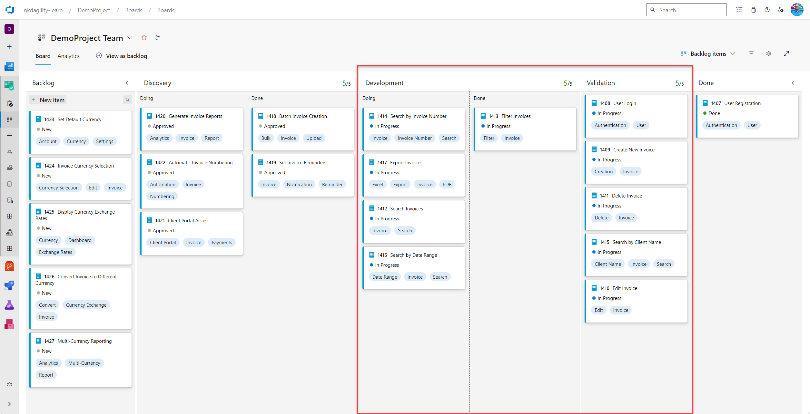

The Daily Scrum is an essential event in the Scrum framework. It offers the
Developers an opportunity to reflect on their progress, and plan for the next 24
hours. But it's essential to approach it with the right mindset and intent.

### Purpose of the Daily Scrum

The primary objective of the Daily Scrum is not merely to go through a checklist
of questions. Instead, it's to actively manage ongoing work and strategize on
how best to achieve the Sprint Goal. This meeting is a platform for Developers
to discuss their work, challenges, and any impediments they might be facing. By
doing so, they can effectively strategize on their next steps and ensure that
they are on the right track.

### Beyond the Three Questions

While the three standard questions—What did I do yesterday? What will I do
today? Are there any impediments in my way?—provide a structure, they shouldn't
become a monotonous routine. Developers should not feel compelled to answer
these questions robotically or feel the unnecessary pressure for everyone to
speak. The focus should be on meaningful conversation and collaboration.

Rather than discussing every item, the team should concentrate on elements in
the Sprint Backlog that require intervention or are at risk. By honing in on
these areas, the team can proactively address potential challenges and ensure
they remain on course.

### Emergent Practices

It's crucial to understand that there's no one-size-fits-all approach to the
Daily Scrum. What works for one team might not necessarily work for another.
Practices should emerge based on the team's unique needs, challenges, and
dynamics. Over time, as the team evolves and matures, so will their practices.

### Asking more interesting questions

The Daily Scrum is not just a routine check-in. It's an opportunity for the team
to come together, collaborate, and strategise. By focusing on the right areas
and fostering open communication, teams can remain aligned with the Sprint Goal
and continue delivering value. Remember, the method in which the team conducts
the Daily Scrum can vary, and what's presented here is just one of many ways!

## Overview of Flow for Daily Scrum

This recipe leverages a simple flow and consists of the following:

The Developers review their progress towards the Sprint Goal. They should
actively manage the work that is in progress and maintain transparency of the
present as reflected in the Sprint Backlog.

*The Developers should own this event and facilitate it, although Scrum Masters
may certainly facilitate as requested or as needed.*

### Why recipe?

You follow a recipe a few times to build muscle memory and understand the
intended outcomes. Once learned one can tweak or change the recipe to adapt the
outcomes to one's own taste.

## Suggested Flow Steps

### Part 1: Review the Work in Process [\~5 mins]

The Developers should review the work currently underway and identify any
problems, issues, or missing information required to get to the Sprint Goal.

Getting to the more interesting questions and enabling us to focus only on the
most valuable conversations requires that we maintain transparency of the Sprint
Backlog so that we can easily see what is going on. We can then visualise that
data in ways that allow us to identify those interesting items.

Any impediments that are identified should be captured and shared with the nessesary people.

#### Facilitation Options

You can use the following visualisations:

-   **Work Item Aging Graph** - A very effective way to review the work that is
    in progress is to use a Work Item Aging graph and pay particular attention
    to the oldest items. By actively managing based on the age of items, the
    Developers can see clearly which items need the most focus, what is blocked,
    and how long they have been in progress.  
     An
    advanced form of this is shown here, where we are also overlaying the 50th,
    70th, 85th, and 95th percentiles for each of the columns in our process.
    Highlighted are 5 anomalies to discuss at this team's Daily Scrum in the
    order of risk to delivery.

-   **Review the Boards** - Another critical visualisation for the Daily Scrum
    is of the work currently in progress using a Board that shows the movement
    of the smallest unit of value, a Backlog Item.   
      
    In this visualisation, the work in progress is everything that is within the
    bounds of the red box. We can immediately see that validation and
    development are both at capacity, so neither can take on any additional
    work. Using WIP Limits in this way, and inspecting them at the Daily Scrum
    allows teams to easily see constraints and identify bottlenecks in this
    process. In this case, we may need to focus on validation to get things into
    done to free up space further “upriver”.

### Part 2: Create an Actionable Plan for 24h [\~10 min]

The outcome of the Daily Scrum should be an increase in the transparency of the
work underway, which should be reflected in the Sprint Backlog. What has
happened in the last 24 hours that needs to be reflected on the Sprint Backlog,
and what is the plan for the next 24 hours? Does the Sprint Backlog still
represent the most essential work to get to the Sprint Goal?

We should leave the Daily Scrum with a plan for the next 24 hours!

#### Facilitation Options

- **Create a Plan** - This can be as simple as a discussion on what needs to happen.

