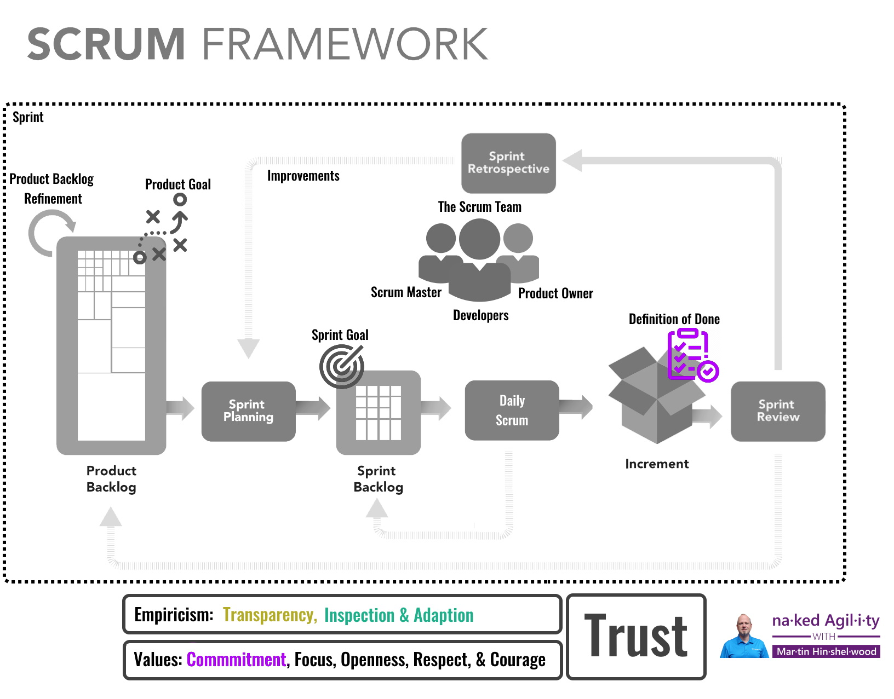
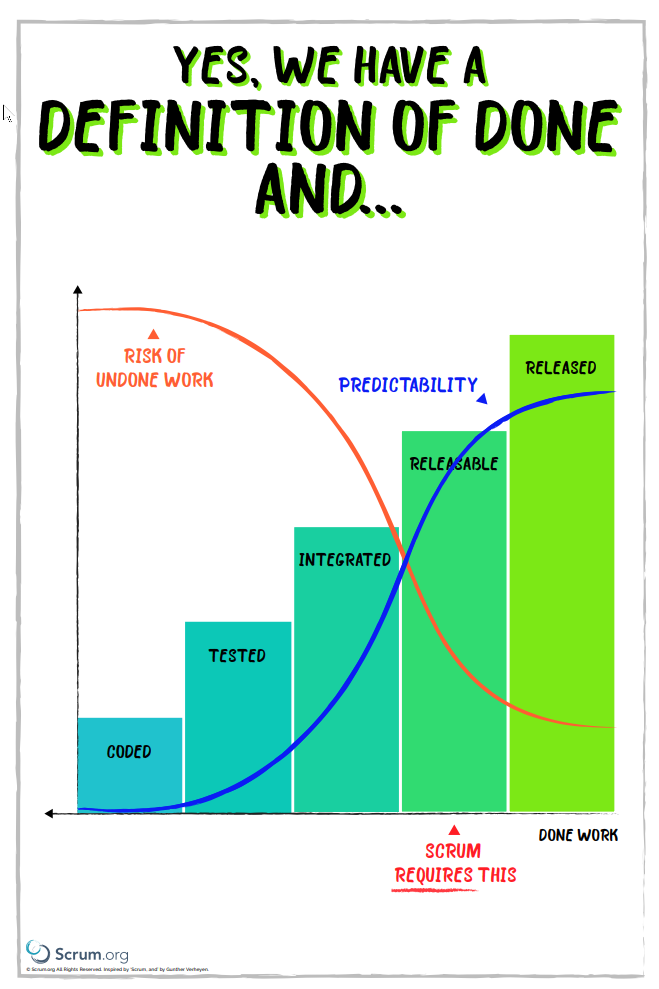

Every team should define what is required, what criteria must be met, for a product increment to be considered releasable. A definition of done. If the organization has not articulated a specific standard, or set of criteria, then the team should create a definition of done that is appropriate for the product. The work produced must comply with the definition of done for it to be considered usable, and if there are multiple teams working on a single product, then those teams must agree on a definition of done and ensure that all teams honour that standard.
{: .lead}

[Developers](./../guides/scrum-guide.md#developers) needs to decide what Done means within the organisational context and the product domain. They need to sit down and create a list of things that must be true for every Increment of software that they deliver. Working Software is not specific to a PBI; it’s applied regardless of PBI to the entire delivery.

> “The Definition of Done creates transparency by providing everyone a shared understanding of what work was completed as part of the Increment. If a Product Backlog item does not meet the Definition of > > Done, it cannot be released or even presented at the Sprint Review. Instead, it returns to the Product Backlog for future consideration.”\\
> --<cite>[The 2020 Scrum Guide](./../guides/scrum-guide.md)</cite>

If you can’t ship working software at least every 30 days then by its very definition, you are not yet doing Scrum. Since [Professional Scrum Teams build software that works](https://nkdagility.com/blog/professional-scrum-teams-build-software-works/), stop, create a working increment of software that meets your definition of done (DoD), and then start Sprinting, and review what you mean by “working” continuously, and at least on a regular cadence.

**The purpose of the definition of done is to provide transparency of what has been done!** This provides the team with focus on whats needed and commitment to the minimum level of quality needed. Every team has full control over the level of quality that they provide. 

A clear shared definition of done allows us to:

1.  Maintain Transparency of what we have Done
2.  Understand how much work is required to deliver an item
3.  Create an agreement of what we show at the Sprint Review
4.  Protect our Brand!

> Live and in production, collecting telemetry supporting or diminishing the starting hypothesis.\\
> --<cite>from Definition of Done (DoD) for the Azure DevOps Product Teams</cite>
{: .blockquote}

## What is Done?

Done does not reflect the requirements, value, or stories. It is a shared understanding of quality.

If you were creating a definition of done for a bakery that would make a number of products you would likely like the following to always be true:

1. Kitchen is clean at time of preparation
2. All ingredients are fresh
3. All items cooked to the appropriate temperature.
4. Each batch taste tested

This short measurable checklist that reflects quality should be true regardless of what the bakery is creating; baguettes, donuts, or meat pies. All must meet this simple definition of done to be sellable and not risk the customers, its employees, or the business.

Before you cut a single line of code, you need to decide what done means for your product and your company. It will be defined very differently if you are building firmware for pacemakers or if you are creating an e-commerce portal. Here are some characteristics of a Definition of Done:

- **A short, measurable checklist** – try and have things on your DoD that can be measured, that you can test the outcome, preferably in an automated fashion.
- **Mirrors shippable** – While you might not have shipped your product, [although we recommended it](https://nkdagility.com/blog/continuous-deliver-sprint/), you should have that choice. Your [Product Owner](./../guides/scrum-guide.md#product-owner) should be able to say, at the [Sprint Review](./../guides/scrum-guide.md#sprint-review): “That’s Awesome… lets ship it.”.
- **No further work** – There should be no further work required from the [Developers](./../guides/scrum-guide.md#developers) to ship your product to production. Any additional work means that you were not Done, and it takes away from the [Product Owner](./../guides/scrum-guide.md#product-owner) capacity for the next iteration. Ideally, you have a fully automated process for delivering software, and [never use staggered iterations for delivery](https://nkdagility.com/blog/a-better-way-than-staggered-iterations-for-delivery/).

A simple definition of DOD from Scrum: "a shared understanding of expectations that the Increment must live up to in order to be releasable into production. Managed by the Scrum Team." 

_Your short, measurable checklist that mirrors usable and results in no further work required to ship your product needs to be defined._ A great way to do this is to get the Scrum Team (the Product Owner plus the Developers and any relevant Stakeholders) into a [facilitated DoD Workshop](./../workshops/definition-of-done.md). Without a Definition of Done we don’t understand what working software means, and without working software we cant have predictable delivery. Your Product Owner can’t reject a Backlog Item, only whether the Increment is working or not.

No mater what you are building you should have a clear and concise definition of done that can be understood and articulated by the whole Team, and ideally by your stakeholders.

## Done Means Releasable

When the [Product Backlog](./../guides/scrum-guide.md#product-backlog) item or an [Increment](./../guides/scrum-guide.md#increment) is described as Done, everyone must understand what that means. Although this varies significantly per team, members must have a shared understanding of what it means for work to be complete to ensure transparency, the foundation of any empirical system. This is the definition of done for the team and is used to assess when work is complete on the product increment. The same definition guides the developers in knowing how many [Product Backlog items](./../guides/scrum-guide.md#product-backlog) they can select during [Sprint Planning](./../guides/scrum-guide.md#sprint-planning). The purpose of each [Sprint](./../guides/scrum-guide.md#the-sprint) is to deliver [Increments](./../guides/scrum-guide.md#increment) of releasable functionality that adhere to the team's current definition of done.

An explicit and concrete definition of done may seem small, but it can be the most critical checkpoint of work. Without a consistent meaning of "Done", we cant know what it takes to get something finished. Conversely, a common definition of done ensures that the increment produced at the end of iteration is of high quality, with minimal defects. The Definition of Done is the soul of Scrum, and mature Developers will resist demonstrating at the Sprint Review (let alone deploying) any increment that is not Done.

{: style="width:250px"}\\
[Scrum Requires Done (PDF)](../assets/attachments/scrum-requires-done.pdf)

#### Releasable

A releasable product is one that has been designed, developed and tested and is therefore ready for distribution to anyone in the organisation for review or even to any external stakeholder. This isn't a prototype or a demo-only release. This is ready for production. Adhering to a list of acceptance criteria ensures that the Increment is truly releasable, meaning:

-   All aspects of quality are ready
-   No corners were cut during development
-   All acceptance criteria were met and verified
-   The Product Owner accepts it

The Product Owner can accept the work at any time during the Sprint. The Sprint Review should not be an "acceptance meeting", but rather an opportunity to inspect the Increment and adapt the Product Backlog.

## My First Definition of Done (DoD)

Your Definition of Done does not just magically appear, and your software does not magically comply with it once it has been created. Making your Software comply with your definition of done is hard work, and while your definition of done should organically grow, you need to create the seed that you can build on.

I recommend that you [run a DoD Workshop](./../workshops/definition-of-done.md) with the entire Scrum Team, and likely some other domain experts or interested parties. If there are *stage gates* that your software has to pass after Developers are Done, then you need representatives from those gates to participate in the workshop. Regardless of your product you likely need representatives with the following expertise; Code, Test, Security, UX, UI, Architecture, etc. You may have this expertise on your team, or you may need to bring in an expert from your organisation, or even external to your organisation.

Here is a list of things that you should consider for your DoD:

-   **Quality code base (clean, readable, naming conventions)** - Agree with Stakeholder(s) / Developers
-   **Architectural conventions respected** - Agree with Stakeholder(s) / Developers
-   **According to design/style guide** - Agree with Stakeholder(s) / Developers
-   **Documented** - Agree with Stakeholder(s) / Developers
-   **Service levels guaranteed (uptime, performance, response time)** - Agree with Stakeholder(s) / Developers
-   **Tested** - Agree with Stakeholder(s) / Developers on the amount of Testing with regard to Integration, Performance, Stability, & Regression

Ultimately ask your self: *"Would you be happy to release this increment to production and support it? You are on call tonight!"*.

Whatever Definition of Done you come up with it is unlikely that your entire Product currently meets the criteria. You are not yet doing Scrum. Before you start Sprinting, you need to focus on making sure that your current Increment meets your new Definition of Done. Focus on Quality, which is what the Developers are accountable for, and make sure that your Increment meets that new quality bar before you start. The next Increment can only reach the quality bar of all those that came before do.

**The Definition of Done is the commitment to quality for the Increment!**

Create a usable increment that meets your definition of done and then start sprinting. Keeping your software in a working state [will require a modern source control system that provides you with the facility to implement good DevOps](https://nkdagility.com/getting-started-with-modern-source-control-system-and-devops/) practices.

## A Starting Point for any Team

Some examples of things for a software team to put on their definition of done:

- **Increment Passes SonarCube checks with no Critical errors** – You will be increasing over time, so maybe you need to say “Code Passes SonarCube checks with no more than 50 Critical errors” then work on it over time.
- **Increment’s Code Coverage stays the same or gets higher** – Looking at a specific measure, like 90%, of code coverage is a read hearing and tells you nothing of code quality. However, it might be advantageous to monitor and measure for adverse change in code coverage, and we always advocate for TDD practices.
- **Increment meets agreed engineering standards** – You should decide rules for naming of methods, tests, variables and everything in-between. Start small and add over time. Link to your agreed standards on a Wiki and continuously improve and expand your rules. Automate if possible.
- **Acceptance Criteria for Increment pass** – Making sure you at least meet the prescribed criteria is a laudable goal and automating them with ATDD practices is even better.
- **Acceptance Tests for Increment are Automated** – Make sure that you automate all of your tests. If you think something will break, then you should have a test for it.
- **Security Checks Pass on Increment** – Use an automated tool as part of your build and check for known security vulnerabilities. You will not find all of your security issues, but at least don’t do things we know to be reflective of poor Security.
- **Increment meets agreed UX standards** – Again, have a Wiki page and make sure that you check it twice. If you are not using an automated DoD entry, then you need to agree as a Team that you have met the criteria.
- **Increment meets agreed Architectural Guidelines** – Wiki’s are fantastic for this, but automate what you can.

There are 4 key layers to your DOD that you should consider:

1.  **Meets organizational DOD** - what is minimum quality level required by your organization to protect its brand and reputation.
2.  **Meets Practice DOD** - Your practice may add additional elements to DONE based on the technical domain within which you are working. 
3.  **Meets Customer DOD** - Additional quality standards required by the customer.
4.  **Your Teams DOD** - Run a DOD workshop to identify what you need from 1,2, & 3 as well as anything that your Scrum Team feels that they need to add.

## Growing your Definition of Done (DoD)

It’s super important that quality is always increasing, and that means that you will need to at least reflect on your Definition of Done on a regular cadence. In Scrum, this cadence is defined by your Sprint length, and you have a Kaizen moment at the Sprint Retrospective. That does not mean that you don’t reflect on your DOD all the time, you do. You reflect continuously on whether your increment currently meets your DoD, and what youd need to do to get it there. You should always be reflecting on whether your DoD fits your needs. If your Developers finds that something is missing from the DoD halfway through the Sprint, then they should go ahead and add it, making sure that they are not endangering the Sprint Goal.

You may discover that you have a performance problem with your product as David Corbin pointed out in my previous post. How do we make sure that we fix that issue? As I see it there are two pieces to this once you are in flight. You can Scrumble (stop Sprinting because of poor quality), and fix it, or you can integrate this new knowledge into your product cycle.

If it is a significant issue that results in you not having working software, then you need to stop and fix. In Scrum, this is called a Scrumble, as a reflection that the Developers stumbled because something is missing. You should stop adding new features and create a usable increment before you continue Sprinting and adding new features. Once you have repaired the issue, you can increase your Definition of Done to make sure that all future Increments meet the new requirements.

If it is less significant, you might want to keep working and add what you need to your Product Backlog. You can then deliver improvements over the next few Sprints that mitigate and then resolve the identified issue. Once you have resolved it, you can then pin the outcome by adding something to your DoD.

**Always look for ways that you can increase your quality. What does your definition of done look like today?**

## Example Definitions of Done

Here are some examples of Done from various teams, real and fictitious.

### Azure DevOps

-   Live in production, collecting telemetry supporting or diminishing the starting hypothesis.

### FABRIKAM TEAM

-   A new feature is driven by one or more tests
-   No known duplication
-   No known bugs
-   Continuous build between DEV and STAGE
-   All available data in the system has been imported into STAGE database

### CONTOSO TEAM

-   Coding is complete
-   Code review performed
-   Coding standards met
-   All tests pass
-   Release notes created
-   User manual updated
-   Developers OK with work
-   Product Owner OK with work

### NORTHWIND TEAM

-   Peer reviewed
-   All test cases pass (including security and performance tests)
-   No open blocking, critical, high or medium bugs
-   Automated tests have been created (unit or integration depending on what is more relevant) and the conditional coverage is at least 50+% for UI, 60+% for services, and 80+% for utility classes.
-   Documentation completed
-   Included in the installer
-   Reviewed by the Product Owner
-   Deployed to the DEMO environment
-   Remaining hours for the task set to zero and the story/task is closed in JIRA.

### TAILSPIN TEAM

-   Documentation has been created/updated
-   Documentation has been peer-reviewed
-   Code has been checked-in to Subversion
-   Code/solution has been reviewed by peer
-   Code is written according to guidelines
-   Code has sufficient comments
-   Code runs without errors in DEV
-   No errors are detected in TEST during normal test operations
-   New functionality has been tested
-   Sample/test data has been created
-   Ad-hoc, exploratory Testing has been performed
-   Best-effort unit tests have been created, executed, and return no warnings or errors
-   Best-effort integration tests have been created, executed, and return no warnings or errors
-   Best-effort user Acceptance tests have been created, executed, and return no warnings or errors
-   Best-effort regression testing has been performed and returns no warnings or errors
-   All rework and retest work has been completed
-   Functionality has been promoted from DEV/TEST to STAGE
-   Functionality has been approved by the Product Owner
