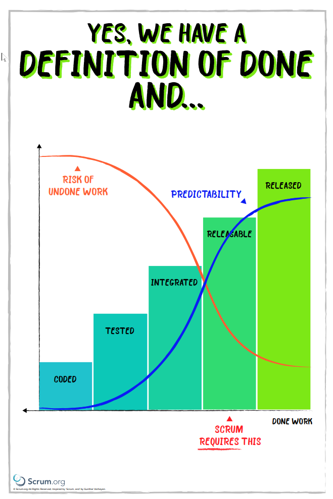

Every team should define what is required, what criteria must be met, for a product increment to be considered releasable. A definition of done. If the organization has not articulated a specific standard, or set of criteria, then the team should create a definition of done that is appropriate for the product. The work produced must comply with the definition of done for it to be considered usable, and if there are multiple teams working on a single product, then those teams must agree on a definition of done and ensure that all teams honour that standard.
{: .lead}

> Live and in production, collecting telemetry supporting or diminishing the starting hypothesis.\\
> --<cite>from Azure DevOps Product DOD</cite>
{: .blockquote}

**The purpose of the definition of done is to provide transparency of what has been done!** This provides the team with focus on whats needed and commitment to the minimum level of quality needed. Every team has full control over the level of quality that they provide. 

A clear shared definition of done allows us to:

1.  Maintain Transparency of what we have Done
2.  Understand how much work is required to deliver an item
3.  Create an agreement of what we show at the Sprint Review
4.  Protect our Brand!

## What is Done?

Done does not reflect the requirements, value, or stories. It is a shared understanding of quality.

If you were creating a definition of done for a bakery that would make a number of products you would likely like the following to always be true:

1. Kitchen is clean at time of preparation
2. All ingredients are fresh
3. All items cooked to the appropriate temperature.
4. Each batch taste tested

This short measurable checklist that reflects quality should be true regardless of what the bakery is creating; baguettes, donuts, or meat pies. All must meet this simple definition of done to be sellable and not risk the customers, its employees, or the business.

A simple definition of DOD from Scrum: "a shared understanding of expectations that the Increment must live up to in order to be releasable into production. Managed by the Scrum Team."  

  <iframe src="https://www.youtube.com/embed/RzWFeLfSnP0" title="YouTube video" allowfullscreen></iframe>

No mater what you are building you should have a clear and concise definition of done that can be understood and articulated by the whole Team, and ideally by your stakeholders.

## Done Means Releasable

When the [Product Backlog](product-backlog.md) item or an [Increment](product-increment.md) is described as Done, everyone must understand what that means. Although this varies significantly per team, members must have a shared understanding of what it means for work to be complete to ensure transparency, the foundation of any empirical system. This is the definition of done for the team and is used to assess when work is complete on the [product increment](product-increment.md). The same definition guides the developers in knowing how many [Product Backlog items](product-backlog.md#what-is-a-product-backlog-item) they can select during [Sprint Planning](/guides/scrum-guide.md#sprint-planning). The purpose of each [Sprint](../guides/scrum-guide.md#the-sprint) is to deliver [Increments](product-increment.md) of releasable functionality that adhere to the team's current definition of done.

An explicit and concrete definition of done may seem small, but it can be the most critical checkpoint of work. Without a consistent meaning of "Done", we cant know what it takes to get something finished. Conversely, a common definition of done ensures that the increment produced at the end of iteration is of high quality, with minimal defects. The Definition of Done is the soul of Scrum, and mature Developers will resist demonstrating at the Sprint Review (let alone deploying) any increment that is not Done.

{: style="width:250px"}\\
[Scrum Requires Done (PDF)](../assets/attachments/Scrum-Requires-Done.pdf)

#### Releasable

A releasable product is one that has been designed, developed and tested and is therefore ready for distribution to anyone in the organisation for review or even to any external stakeholder. This isn't a prototype or a demo-only release. This is ready for production. Adhering to a list of acceptance criteria ensures that the Increment is truly releasable, meaning:

-   All aspects of quality are ready
-   No corners were cut during development
-   All acceptance criteria were met and verified
-   The Product Owner accepts it

The Product Owner can accept the work at any time during the Sprint. The Sprint Review should not be an "acceptance meeting", but rather an opportunity to inspect the Increment and adapt the Product Backlog.

## Your Definition of Done

Here is a list of things that you should consider for your DoD:

-   **Quality code base (clean, readable, naming conventions)** - Agree with Stakeholder(s) / Developers
-   **Architectural conventions respected** - Agree with Stakeholder(s) / Developers
-   **According to design/style guide** - Agree with Stakeholder(s) / Developers
-   **Documented** - Agree with Stakeholder(s) / Developers
-   **Service levels guaranteed (uptime, performance, response time)** - Agree with Stakeholder(s) / Developers
-   **Tested** - Agree with Stakeholder(s) / Developers on the amount of Testing with regard to Integration, Performance, Stability, & Regression

Ultimately ask your self: *"Would you be happy to release this increment to production and support it? You are on call tonight!"*.

## A Starting Point for any Team

1.  **Meets organizational DOD** (see [Organizational DOD](#organisational-dod))
2.  **+Meets Practice DOD** - Your practice may add additional elements to DONE based on the technical domain within which you are working. 
3.  **+Meets Customer DOD** - Additional quality standards required by the customer.
4.  +**[Your DOD]** - Run a DOD workshop to identify what you need from 1,2, & 3 as well as anything that your Scrum Team feels that they need to add.

### Organisational DOD

These items are mandatory and are required by [Company] to protect our brand and reputation.

1.  **Code\Configuration is under Source Control**
2.  **Automated Builds are Green** - No exceptions; all automated builds MUST be green. It is more important to have working builds than to add features.
3.  **Automated Tests are Green** - No exceptions; all tests written MUST be green. You should actively refactor your test inventory for viability, relevance, Value, & flakiness. Testing should reflect your best effort to protect our reputation based on the technology at hand.
4.  **No known security issues** - (Suggestion: Use SonarQube to analyse code at a minimum)
5. **Clean / Readable Code** - Your code should meet agreed naming conventions & style guidelines.

## References

- [The Scrum Guide](/guides/scrum-guide.md#commitment-definition-of-done)

## Example Definitions of Done

Here are some examples of Done from various teams, real and fictitious. 

### Azure DevOps

-   Live in production, collecting telemetry supporting or diminishing the starting hypothesis.

### FABRIKAM TEAM

-   A new feature is driven by one or more tests
-   No known duplication
-   No known bugs
-   Continuous build between DEV and STAGE
-   All available data in the system has been imported into STAGE database

### CONTOSO TEAM

-   Coding is complete
-   Code review performed
-   Coding standards met
-   All tests pass
-   Release notes created
-   User manual updated
-   Developers OK with work
-   Product Owner OK with work

### NORTHWIND TEAM

-   Peer reviewed
-   All test cases pass (including security and performance tests)
-   No open blocking, critical, high or medium bugs
-   Automated tests have been created (unit or integration depending on what is more relevant) and the conditional coverage is at least 50+% for UI, 60+% for services, and 80+% for utility classes.
-   Documentation completed
-   Included in the installer
-   Reviewed by the Product Owner
-   Deployed to the DEMO environment
-   Remaining hours for the task set to zero and the story/task is closed in JIRA.

### TAILSPIN TEAM

-   Documentation has been created/updated
-   Documentation has been peer-reviewed
-   Code has been checked-in to Subversion
-   Code/solution has been reviewed by peer
-   Code is written according to guidelines
-   Code has sufficient comments
-   Code runs without errors in DEV
-   No errors are detected in TEST during normal test operations
-   New functionality has been tested
-   Sample/test data has been created
-   Ad-hoc, exploratory Testing has been performed
-   Best-effort unit tests have been created, executed, and return no warnings or errors
-   Best-effort integration tests have been created, executed, and return no warnings or errors
-   Best-effort user Acceptance tests have been created, executed, and return no warnings or errors
-   Best-effort regression testing has been performed and returns no warnings or errors
-   All rework and retest work has been completed
-   Functionality has been promoted from DEV/TEST to STAGE
-   Functionality has been approved by the Product Owner